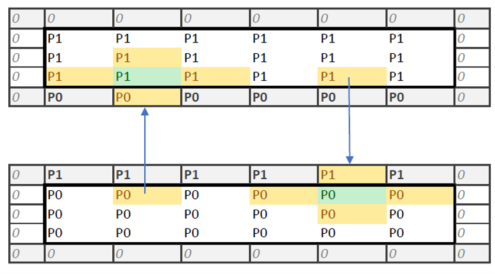
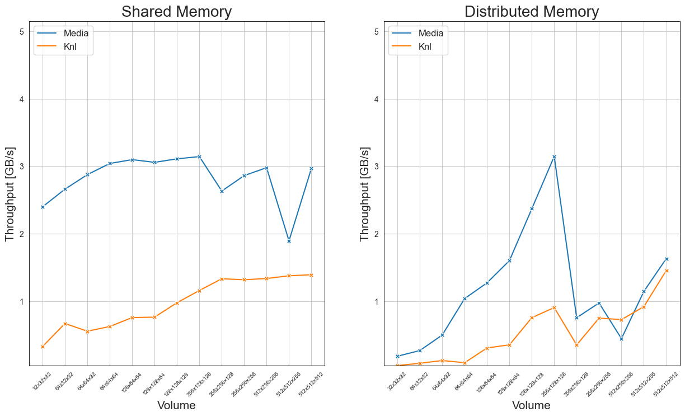

Implementation of a 3-dimensional stencil, with values stored in a 1-dimensional array. For neighbor access and ghost cells in the parallel implementation, padding is added in all three dimensions.

## Parallel implementation

The stencil is implemented as follows:
1. 3d array is split in z-direction, with a tile for each UPCXX process;
2. Left and right ghost cells (neighboring cells) are retrieved using `upcxx::rget`.

This approach roughly follows the 1-dimensional stencil example of the [UPCXX programmer's guide][ref-1].



For the first point, it is important that the size of the z chunk is *not* lower than the radius. Otherwise, too many elements will be retrieved when fetching the ghost cells, leading to false results.

For the second point, when using `upcxx::rget` additional synchronization is required between retrieving left and right neighbors to avoid modifying values that are still being transferred. From [UPCXX Specification][ref-2], 8.2.2:

> Initiates a transfer of count values of type T beginning at src and stores them in the locations beginning at dest. The source values must not be modified until operation completion is notified.

In particular, we synchronize twice in each time step before computing values.

```c++
// As rget does not allow source values to be modified until operation completion is notified,
// first retrieve all right neighbors, then all left neighbors.
if (proc_id != proc_n - 1) {
    upcxx::global_ptr<float> input_r = input_g.fetch(proc_id + 1).wait();
    upcxx::rget(input_r + n_ghost_offset,
                input + n_local - n_ghost_offset,
                n_ghost_offset).wait();
}
upcxx::barrier();

if (proc_id != 0) {
    upcxx::global_ptr<float> input_l = input_g.fetch(proc_id - 1).wait();
    upcxx::rget(input_l + n_local - 2*n_ghost_offset,
                input,
                n_ghost_offset).wait();
}
upcxx::barrier();
```

## Comparison to sequential implementation

As in [reduction](reduction) and [symmetrization](symmetrization), input arrays are filled with random values. Specific here is that array padding must be taken into account:
```c++
// ...

// Fill inside of block with pseudo-random values
if (x >= radius && x < Nx - radius &&
    y >= radius && y < Ny - radius &&
    z >= radius && z < Nz - radius)
{
    Veven[offset] = dist1(rgen);
    Vodd[offset] = 0;
    Vsq[offset] = dist2(rgen);
}
```

When printing the stencil in the parallel implementation, the offset for this padding (in each process) must be taken into account. (See `include/stencil-print.hpp`.)

## Benchmarks

We use the following criteria for benchmarking:

* Throughput is computed as `steps * sizeof(float) * dim_x * dim_y * dim_z * 1e-9 / time`;
* Array intialization is not timed, only stencil time steps;
* Throughput is averaged over 100 iterations;
* 5 time steps are taken with radius 2;
* 4 (SKL) and 16 (KNL) processes per node.



## Possible improvements

As the benchmarks indicate, there is a lot of room for improvement. The following are a few possible approaches.

* Use `upcxx::dist_object` for asynchronous point-to-point communication. This should remove the need to synchronize twice when retrieving ghost cells.
* *Latency hiding*: compute the inner cells asynchronously. When the ghost cells are available, compute the border cells as well.
* The amount of ghost cells grows quadratically (compared to cubically for the total amount of cells). To reduce the amount of ghost cells, the array could be divided amongst processes in all three dimensions. 
  * This can be done with a threading mechanism combined with a low amount of UPCXX processes (see [reduction](reduction#Tasks)), or `upcxx::local_team`. Latter requires more effort: a tile is broadcast amongst many processes, and the user must ensure the correct offsets.

[ref-1]: https://upcxx.lbl.gov/docs/html/guide.html
[ref-2]: https://bitbucket.org/berkeleylab/upcxx/downloads/upcxx-spec-2020.10.0.pdf