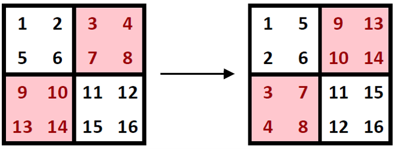
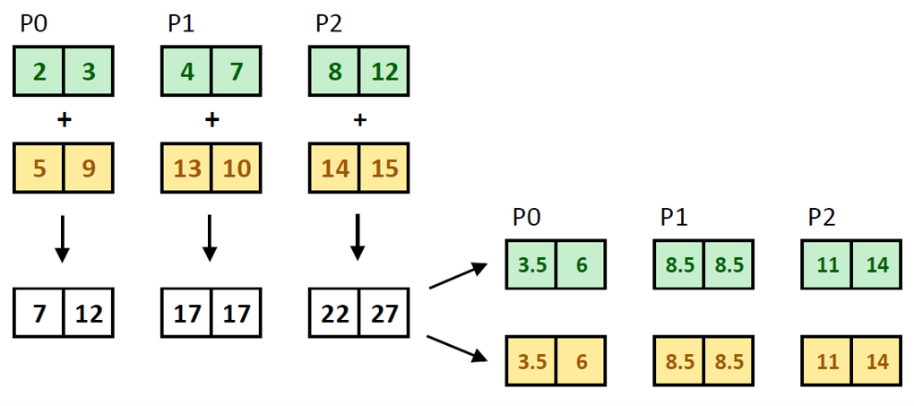
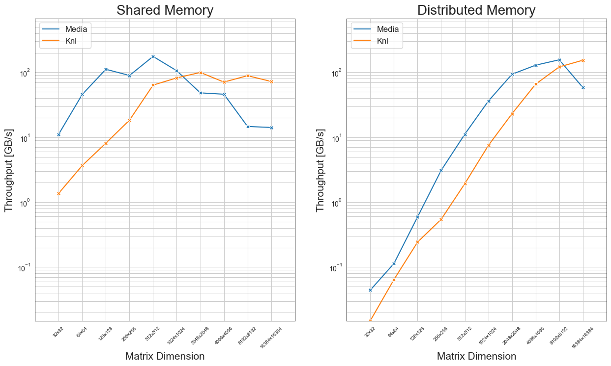
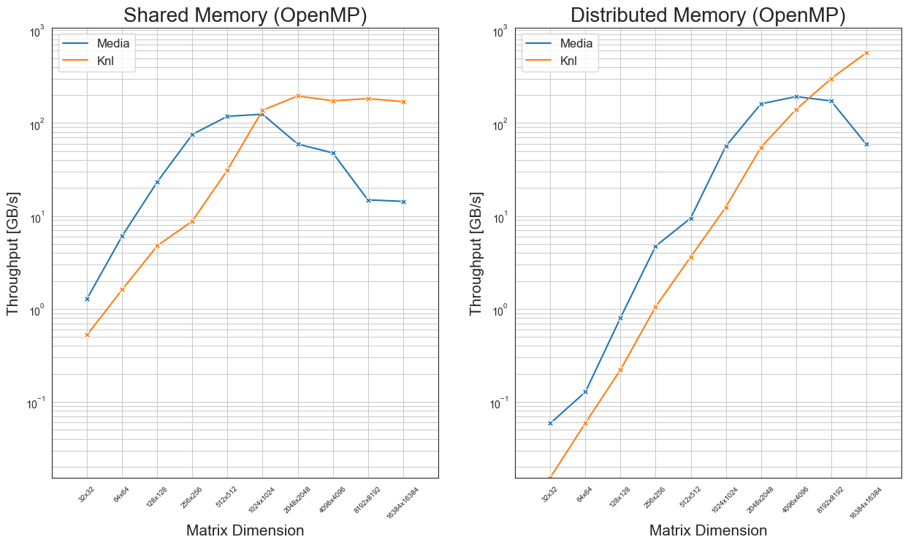

- [Data placement](#data-placement)
- [Comparison to sequential implementation](#comparison-to-sequential-implementation)
- [Parallel implementation](#parallel-implementation)
  - [Benchmarks](#benchmarks)

In the following, $`A`$ is a square matrix of dimension $`n \times n`$.

## Data placement

When storing matrix elements as a contiguous array (to reduce allocation costs and improve data locality), we have the following options:

* **Row-major order**, where the consecutive elements of a row reside next to each other, and
* **Column-major order**, where the same holds true for consecutive elements of a column.

When we partition the matrix into blocks (each stored contiguously in row-major or column-major order), part of these blocks need to exchange elements to transpose (and symmetrize) the matrix. This leads to communication overhead when blocks are located on different nodes. To avoid this, we instead partition the matrix as follows:



* array `diag` for the diagonal elements;
* array `lower` for the lower triangle, stored in *column-major* order;
* array `upper` for the upper triangle, stored in *row-major* order.

Storing the lower and upper triangle in this "mirrored" fashion allows to retrieve an element $`a_{ij}`$ and its transpose $`a_{ji}`$ from a single index $`k`$. Symmetrization is then a SAXPY operation: add `lower` and `upper`, and scale the sum. In particular, only a single for loop is required to symmetrize the matrix.

**Note:** A complete implementation of this concept is available in the `TriMatrix` class (see `matrix/trimatrix.h`). Arrays are of a fixed size and wrapped in `std::unique_ptr` (i.e. for "first-touch" initialization on NUMA machines).

In a parallel implementation, the above arrays are chunked per process:

* Diagonal: `n / nproc`
* Lower triangle: `dim * (dim-1) / 2 / nproc`
* Upper triangle: `dim * (dim-1) / 2 / nproc`

where `nproc` represents the amount of processes.



## Comparison to sequential implementation

Verification consists of two steps:
1. Check the symmetrization using lower and upper matrices against a typical row-major transposition;
2. Check if parallel symmetrization has the same result as sequential symmetrization.

The first point is covered by comprehensive unit tests using the Catch2 library. (See `serial_test.cpp` and `matrix/test.cpp`.) In particular, the following offsets were used to convert back to row-major format:
```c++
std::ptrdiff_t offset_lower_col_major(std::ptrdiff_t i, std::ptrdiff_t j, std::ptrdiff_t n) {
    // 1st summand: expansion of n*(n-1)/2 - (n-1-j)*(n-j)/2
    // 2nd summand: offset for i
    return j*(2*n - 1 - j)/2 + (i - j - 1);
}

std::ptrdiff_t offset_upper_row_major(std::ptrdiff_t i, std::ptrdiff_t j, std::ptrdiff_t n) {
    // 1st summand: expansion of n*(n-1)/2 - (n-1-i)*(n-i)/2
    // 2nd summand: offset for j
    return i*(2*n - 1 - i)/2 + (j - i - 1);
}
```

For the second point, both the serial and parallel implementation allow to print the matrices (before and after symmetrization) to a file and both are initialized with the same pseudo-random values. The resulting files can then directly be compared, e.g. with `diff`:

```bash
symmetrize/symmetrize --dim "$dim" --write

printf >&2 'symmetrize-upcxx, dimension %d, iteration %d\n' "$dim" "$i"
upcxx-run -n 4 -shared-heap 50% symmetrize/symmetrize-upcxx --dim "$dim" --write

diff -q 'serial_matrix.txt' 'upcxx_matrix.txt'
diff -q 'serial_matrix_symmetrized.txt' 'upcxx_matrix_symmetrized.txt'
```

## Parallel implementation

As discussed in [reduction](reduction#Tasks), our implementation uses both UPCXX processes and OpenMP threads. The split of a matrix to its lower and upper triangles avoids any kind of communication, so we expect a lower benefit from OpenMP in this case. An improvement over a high amount of processes is however still measurable (see the [benchmarks](#benchmarks) section).

Lower and upper triangle are initialized with pseudo-random values:
```c++
std::mt19937_64 rgen(seed);
rgen.discard(proc_id * triangle_n * 2);

for (index_t i = 0; i < triangle_n; ++i) {
    lower[i] = 0.5 + rgen() % 100;
    upper[i] = 1.0 + rgen() % 100;
}
```

As outlined in [data placement](#data-placement), symmetrization is done with a single for loop and without communication:
```c++
for (index_t i = 0; i < triangle_n; ++i) {
    float s = (lower[i] + upper[i]) / 2.;
    lower[i] = s;
    upper[i] = s;
}
upcxx::barrier(); // ensure symmetrisation is complete
```

### Benchmarks

We use the following criteria for benchmarking:

* Throughput is computed as `dim * (dim-1) * sizeof(float) * 1e-9 / time`;
* Matrix intialization is not timed, only symmetrization;
* 100 iterations are performed per dimension `N`, with `time` taken as the average over these iterations;
* `OMP_PROC_BIND` is set to `true`;
* `OMP_PLACES` is set to `cores`.

Process and thread amount are chosen as dimension allows. In particular:

| Benchmark        | Nodes | Processes | Dimension |
| ---------------- | ----- | --------- | --------- |
| KNL, shared      | 1     | 64        | >= 1<<8    |
| SKL, shared      | 1     | 4         | >= 1<<5    |
| KNL, distributed | 4     | 256       | >= 1<<10   |
| SKL, distributed | 4     | 16        | >= 1<<6    |

for the UPCXX benchmarks, and:

| Benchmark        | Nodes | Processes | Threads | Dimension |
| ---------------- | ----- | --------- | ------- | --------- |
| KNL, shared      | 1     | 1         | 64      | >= 1<<8    |
| SKL, shared      | 1     | 1         | 4       | >= 1<<5    |
| KNL, distributed | 4     | 4         | 256     | >= 1<<10   |
| SKL, distributed | 4     | 4         | 16      | >= 1<<6    |

for the UPCXX + OpenMP benchmarks.


